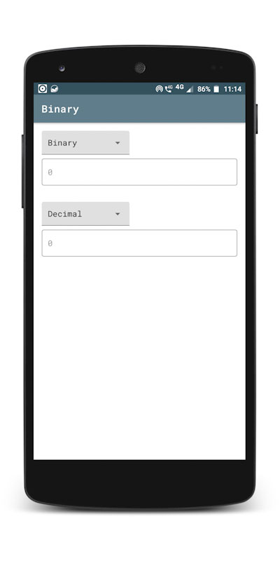
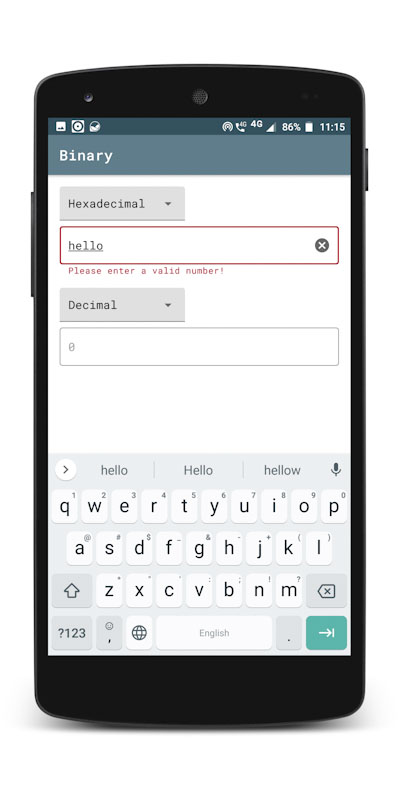
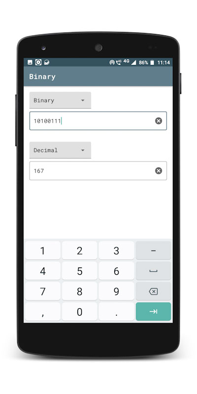
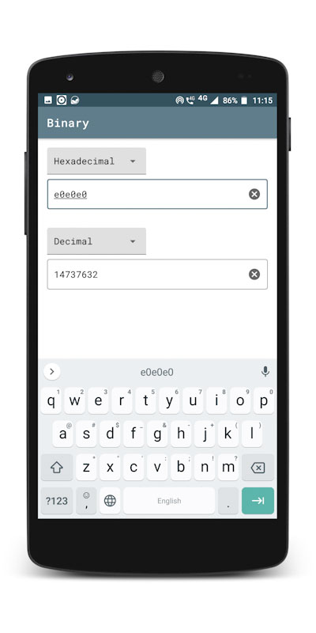

# Binary

Binary is a small Android app which can convert number systems.

## Features

* Supports the 4 famous number systems - _Binary, Octal, Decimal, Hexadecimal_
* Automatically convert when the number changes
* Flags an error if the number doesn't match its selected number system

## Screenshots

## License

Copyright &copy; Kahan D. Bhalani 2020

This project is licensed under the [MIT](https://github.com/KdB13/Binary/blob/master/LICENSE) license.